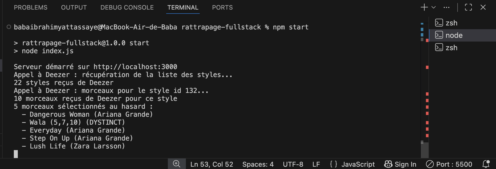

# OKOCHA PROD

Application de recommandation musicale développée en Node.js dans le cadre du rattrapage Fullstack (HETIC, cours de Corto Dufour).

## Fonctionnalités

- Création de compte et connexion utilisateur (mots de passe hachés avec bcrypt, authentification par session)
- Choix d'un style musical parmi une liste de tags (Rock, Rap/Hip Hop, Pop, Jazz...)
- Récupération de 5 morceaux aléatoires correspondant au style choisi, via l'API Deezer
- Front responsive (adapté mobile et desktop)

## Stack technique

- Node.js / Express
- MySQL (via mysql2)
- bcrypt (hachage des mots de passe)
- express-session (gestion de la connexion)
- API Deezer (recherche de morceaux par genre)
- HTML / CSS / JavaScript natif côté front

## Prérequis

- Node.js (testé avec la v24)
- Un serveur MySQL local (MAMP, WAMP, XAMPP, ou une installation MySQL classique)
- Git

## Installation

1. Cloner le repo

```bash
git clone https://github.com/Okocha224/rattrapage-fullstack-hetic.git
cd rattrapage-fullstack-hetic
```

2. Installer les dépendances

```bash
npm install
```

3. Configurer la connexion à la base de données

Copier le fichier `config.js.ext` en `config.js` :

```bash
cp config.js.ext config.js
```

Puis remplir `config.js` avec tes propres informations de connexion MySQL :

```javascript
const config = {
  db: {
    host: "127.0.0.1",
    port: 8889,
    user: "root",
    password: "root",
    database: "music_reco_db",
  },
  sessionSecret: "remplace-par-une-phrase-secrete",
  listPerPage: 10,
};

module.exports = config;
```

Le `port` dépend de l'installation MySQL locale : souvent `8889` sur MAMP (Mac), `3306` sur une installation MySQL standard ou WAMP/XAMPP. `config.js` n'est jamais versionné sur Git (voir `.gitignore`) ; `config.js.ext` sert de modèle pour recréer ce fichier.

4. Créer la base de données et les tables (migrations)

```bash
node migrations/dbCreate.js
node migrations/tableCreate.js
```

5. Démarrer le serveur

```bash
npm start
```

Le serveur démarre sur `http://localhost:3000`.

## Utilisation

1. Aller sur `http://localhost:3000`
2. Créer un compte, puis se connecter
3. Une fois connecté, redirection automatique vers la page de découverte musicale
4. Choisir un style dans le menu déroulant, cliquer sur "Découvrir"
5. 5 morceaux aléatoires correspondant à ce style s'affichent, avec pochette, titre, artiste et un extrait audio quand il est disponible

## API utilisée

Ce projet utilise l'API publique de [Deezer](https://developers.deezer.com/api), qui ne nécessite aucune clé d'authentification ni inscription. Aucune configuration supplémentaire n'est donc nécessaire pour cette partie.

## Choix techniques et justifications

Quelques décisions prises pendant le développement méritent d'être expliquées, pour que leur raisonnement soit clair même sans échange oral.

### Pourquoi Deezer plutôt que Spotify

Le sujet cite Spotify en exemple, avec un appel direct pour les recommandations. Cependant, Spotify a supprimé son endpoint `/recommendations` (ainsi que plusieurs autres) en novembre 2024 pour toutes les nouvelles applications — cet appel direct n'est donc plus disponible aujourd'hui. Deezer a été choisi comme alternative : son API publique ne nécessite aucune clé ni authentification, ce qui correspond bien à l'objectif de simplicité du backend Node demandé par le sujet.

### Comment le "style musical" a été interprété

Le sujet demande de "demander un style de musique à l'utilisateur (sous système de tag, ex: Rock)". Cette application traduit cette exigence par un menu déroulant rempli dynamiquement avec la vraie liste de genres fournie par Deezer (Rock, Pop, Rap/Hip Hop, Jazz...) — l'utilisateur choisit un tag parmi cette liste, exactement comme l'exemple donné dans le sujet.

### D'où viennent les morceaux "aléatoires"

Deezer ne propose pas d'endpoint de recommandation aléatoire prêt à l'emploi. La solution mise en place : récupérer le classement des morceaux populaires du style choisi (`GET /chart/{id_du_style}/tracks`), puis sélectionner 5 morceaux au hasard dans cette liste avec une fonction écrite pour ce projet (`pickRandom`, qui mélange le tableau avec `Math.random()`). Le tirage aléatoire est donc réalisé par le backend de l'application, à partir des données fournies par l'API — ce qui répond à la demande du sujet ("API de votre choix pour récupérer aléatoirement des morceaux").

### Sur l'organisation Git

Ce projet étant réalisé en solo (pas de collaborateur à coordonner), l'ensemble du développement a été fait directement sur la branche `main`, avec un commit atomique et descriptif à chaque fonctionnalité terminée et testée (voir l'historique des commits), plutôt qu'avec des branches par feature — une simplification volontaire.

## Structure du projet

```
rattrapage-fullstack/
├── migrations/
│   ├── dbCreate.js
│   └── tableCreate.js
├── routes/
│   ├── auth.js
│   └── music.js
├── services/
│   ├── db.js
│   ├── authService.js
│   └── musicService.js
├── public/
│   ├── index.html
│   ├── dashboard.html
│   ├── css/style.css
│   └── js/
│       ├── app.js
│       └── dashboard.js
├── config.js.ext
├── index.js
└── package.json
```

## Sécurité

- Mots de passe hachés avec bcrypt, jamais stockés en clair
- Authentification par session (cookie signé côté serveur), routes musicales protégées derrière la connexion
- Requêtes SQL paramétrées (protection contre l'injection SQL)
- `config.js` exclu du dépôt Git via `.gitignore`

## Preuve du fonctionnement du backend

La capture ci-dessous montre les logs du serveur pendant une utilisation réelle de l'application : l'appel à l'API Deezer, le nombre de styles et de morceaux reçus, et la sélection aléatoire de 5 morceaux effectuée côté backend.



